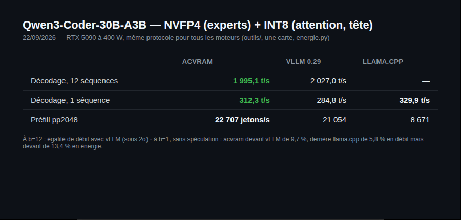

<p align="center">
  
</p>

# anticitoyen VRAM/RAM (`acvram`)

<p align="center">
  <a href="https://github.com/anticitoyun/anticitoyen-vram/releases/latest"></a>
  <a href="https://github.com/anticitoyun/anticitoyen-vram/actions/workflows/tests.yml"></a>
  <a href="LICENSE"></a>
  <a href="https://buymeacoffee.com/anticitoyen"></a>
</p>

Une passerelle d'inférence compatible avec l'API OpenAI, qui traite la mémoire comme une hiérarchie, donne à chaque GPU le format numérique que son silicium sait le mieux lire, et optimise chaque jeton en joules autant qu'en secondes.

<div align="center">

**🇫🇷 Français** · [🇬🇧 English](docs/README.en.md) · [🇸🇦 العربية](docs/README.ar.md) · [🇧🇩 বাংলা](docs/README.bn.md) · [🇪🇸 Català](docs/README.ca.md) · [🇨🇿 Čeština](docs/README.cs.md) · [🇩🇰 Dansk](docs/README.da.md) · [🇩🇪 Deutsch](docs/README.de.md) · [🇬🇷 Ελληνικά](docs/README.el.md) · [🌐 Esperanto](docs/README.eo.md) · [🇪🇸 Español](docs/README.es.md) · [🇮🇷 فارسی](docs/README.fa.md) · [🇫🇮 Suomi](docs/README.fi.md) · [🇮🇱 עברית](docs/README.he.md) · [🇮🇳 हिन्दी](docs/README.hi.md) · [🇭🇺 Magyar](docs/README.hu.md) · [🇮🇩 Bahasa Indonesia](docs/README.id.md) · [🇮🇹 Italiano](docs/README.it.md) · [🇯🇵 日本語](docs/README.ja.md) · [🇰🇷 한국어](docs/README.ko.md) · [🇳🇴 Norsk bokmål](docs/README.nb.md) · [🇳🇱 Nederlands](docs/README.nl.md) · [🇵🇱 Polski](docs/README.pl.md) · [🇵🇹 Português](docs/README.pt.md) · [🇷🇴 Română](docs/README.ro.md) · [🇷🇺 Русский](docs/README.ru.md) · [🇸🇪 Svenska](docs/README.sv.md) · [🇹🇭 ไทย](docs/README.th.md) · [🇹🇷 Türkçe](docs/README.tr.md) · [🇺🇦 Українська](docs/README.uk.md) · [🇻🇳 Tiếng Việt](docs/README.vi.md) · [🇨🇳 中文](docs/README.zh.md)

</div>

<p align="center"></p>

---

## Sommaire

- [Les deux idées](#idees)
- [Démarrage rapide](#demarrage)
- [Installer](#installer)
- [Ce que dit `acvram plan`](#plan)
- [Aller vite](#optimisations)
- [Points d'entrée HTTP](#http)
- [D'où viennent les chiffres](#chiffres)
- [Documentation](#documentation)
- [Résultats mesurés](#resultats)
- [État](#etat)
- [Crédits](#credits)
- [Licence](#licence)
- [Soutenir le projet](#soutien)

---

<a id="idees"></a>

## Les deux idées

Conçue pour une machine précise :

| | |
|---|---|
| Processeur | Intel Core i9-14900K (8 cœurs P + 16 cœurs E) |
| Carte mère | ASUS ROG Maximus Z790 Dark Hero |
| Mémoire | 96 Go DDR5 |
| GPU 0 | ASUS RTX 5090 Astral LC OC, 32 Go — Blackwell, `sm_120` |
| GPU 1 | ASUS RTX 3080 Ti, 12 Go — Ampere, `sm_86` |
| Système | Ubuntu 26.04 LTS (CUDA 13) ; les deux cartes en PCIe x8/x8, bridées 400 W / 275 W |

**Un format par GPU.** La RTX 5090 possède des tensor cores FP4 ; la RTX 3080 Ti n'en a pas, et n'a pas non plus de FP8. Aligner les deux sur un format commun gâcherait la 5090. Le convertisseur écrit donc *deux fois le même modèle*, dans le format que chaque destination sait réellement exploiter :

| | RTX 5090 | RTX 3080 Ti |
|---|---|---|
| poids | **NVFP4** — E2M1 + échelle FP8 E4M3 tous les 16 | **INT4** — uint4 + échelle et zéro fp16 tous les 128 |
| bits par poids | 4,50 | 4,16 |
| face au BF16 | ×3,56 plus petit | ×3,85 plus petit |
| mode de calcul | tensor cores FP4 | déquantifié en FP16 dans le noyau, tensor cores FP16 |
| cache KV | INT8 | INT8 |

32 Go de VRAM à 4,5 bits par poids contiennent environ **56 milliards de paramètres**, contre 16 milliards en BF16. Sur les deux cartes, cela fait approximativement **78 milliards de paramètres résidents** avant même de toucher à la mémoire vive.

**La mémoire est une hiérarchie, pas un mur.** Trois étages, et le planificateur mesure ce que chacun coûte au lieu d'espérer que le modèle tienne :

```
RTX 5090     32 Go   ~1790 Go/s     NVFP4
RTX 3080 Ti  12 Go    ~912 Go/s     INT4
DDR5 hôte    96 Go   limité par le PCIe ou la DDR
```

---

<a id="demarrage"></a>

## Démarrage rapide

```bash
./install.sh                       # environnement virtuel + torch cu128 + acvram
acvram doctor                      # cette machine est-elle prête, et pour quoi
acvram detect                      # qu'y a-t-il réellement ici

acvram plan  ~/modeles/Qwen3-32B                    # où irait chaque couche
acvram convert ~/modeles/Qwen3-32B -o ~/acv/qwen3-32b
acvram serve ~/acv/qwen3-32b --port 8000
```

N'importe quel client OpenAI s'y branche ensuite :

```bash
curl http://127.0.0.1:8000/v1/chat/completions \
  -H 'Content-Type: application/json' \
  -d '{"model":"qwen3-32b","messages":[{"role":"user","content":"Bonjour"}],"stream":true}'
```

```python
from openai import OpenAI
client = OpenAI(base_url="http://127.0.0.1:8000/v1", api_key="inutilise")
client.chat.completions.create(model="qwen3-32b",
                               messages=[{"role": "user", "content": "Bonjour"}])
```

---

<a id="installer"></a>

## Installer

Depuis la source (toutes plateformes) :

```bash
git clone https://github.com/anticitoyun/anticitoyen-vram.git && cd anticitoyen-vram
./install.sh
```

Ou par paquet, un fichier joint à chaque [release GitHub](https://github.com/anticitoyun/anticitoyen-vram/releases/latest) :

| Canal | Fichier joint à la release | Commande |
|---|---|---|
| Debian / Ubuntu (.deb) | `acvram_<version>_amd64.deb` | `sudo dpkg -i acvram_<version>_amd64.deb` |
| Arch (AUR) | `aur-<version>.tar.gz` (PKGBUILD + .SRCINFO) | `tar xzf aur-<version>.tar.gz && cd acvram && makepkg -si` |
| Fedora / COPR (RPM) | `.rpm` / `.src.rpm` (noms générés par `rpmbuild`, non fixes) | `sudo rpm -i acvram-<version>-1.*.noarch.rpm` (ou `rpmbuild --rebuild *.src.rpm` depuis le `.src.rpm`) |
| Flatpak | `acvram-<version>.flatpak` | `flatpak install acvram-<version>.flatpak` |

Pip n'est pas publié comme paquet (pas de roue construite) : `pip install -e '.[dev]'` installe depuis un clone de la source, comme `./install.sh`.

---

<a id="plan"></a>

## Ce que dit `acvram plan`

Le planificateur mérite d'être lancé avant tout téléchargement. Il répond aux questions qui décident si un modèle est utilisable sur cette machine :

```
$ acvram plan ~/modeles/Llama-3.3-70B --max-model-len 32768 --max-seqs 4

  etage   format      capacite      poids         KV  tranche
  cuda:0  nvfp4        30,3 Gio   25,5 Gio   4,5 Gio  couches 0-58
  cuda:1  int4_awq     10,9 Gio    8,7 Gio   1,6 Gio  couches 59-79
  cpu     nvfp4        74,8 Gio    3,4 Gio       0 o  -

  poids au total     37,6 Gio
  lu par jeton       35,1 Gio
  KV par jeton       162,5 Kio  -> 39 843 jetons en cache
  MLP en RAM hote    55-58

  decodage estime    17,8 jetons/s  (lot de 1)
  prefill estime     847 jetons/s
```

Il explore l'espace des configurations au lieu de retenir la première qui tient, et deux de ses décisions sont assez contre-intuitives pour mériter d'être énoncées :

* **Il laisse la 3080 Ti inutilisée** quand un modèle tient sur la seule 5090. Les tranches d'un pipeline s'exécutent en série : ajouter une étape à 912 Go/s dans un pipeline à 1790 Go/s ralentit le décodage mono-flux. On force avec `--gpus all`.
* **Il rétrécit le cache KV pour garder les poids en VRAM.** Chaque gigaoctet donné au cache est un gigaoctet de poids repoussé sur le bus PCIe, et lire un poids par le PCIe coûte environ trente fois ce qu'il coûte depuis la VRAM. Sur le 70B ci-dessus, ce seul arbitrage fait passer de 2,3 à 17,8 jetons/s.

---

<a id="optimisations"></a>

## Aller vite

Quatre optimisations, chacune vérifiée par une preuve d'équivalence et pas seulement par un chronomètre : une optimisation qui change la réponse est un bogue.

Les linéaires NVFP4 des modèles denses passent par défaut par la disposition Marlin (+57 à +90 % de débit à b = 8, TTFT +2 à +4 ms selon revue/poste6-piece147-verdict-24-09.md ; repli `ACVRAM_PROJ_MARLIN=0`, voir [CHANGELOG.md](CHANGELOG.md)).

### Décodage spéculatif (`--speculative`)

Décoder un jeton avec un lot de taille 1 est limité par la mémoire : la machine lit tous les poids actifs pour produire un seul jeton. Vérifier K jetons proposés lit ces mêmes poids **une seule fois**. Deux propositeurs :

* `ngram` (par défaut) — cherche le suffixe courant plus tôt dans le contexte et propose ce qui suivait. Ne coûte rien, ne demande aucun modèle. Rentable quand la sortie recopie l'entrée : édition de code, RAG, résumé.
* `draft` — un petit modèle sur un second appareil. Sur ce rig, cet appareil est la RTX 3080 Ti, que le planificateur laisse volontairement oisive pour tout modèle qui tient sur la 5090.

`mtp` (tête `nextn` du modèle) et `auto` existent aussi ; non rentables en l'état et non activés par défaut — voir `docs/ARCHITECTURE.md`.

L'acceptation est exacte, pas approchée : une proposition est acceptée avec la probabilité `min(1, p/q)` et un rejet rééchantillonne dans la partie positive normalisée de `p - q`. Mesuré sur 40 000 tirages face à un brouillon volontairement mal calibré, la distribution émise reste à 0,002 de variation totale de la cible — la spéculation achète de la vitesse, jamais une réponse différente.

```
modele jouet, glouton, k=4    etapes   jetons/etape   sortie
  sans speculation                23           1,00   reference
  n-grammes                       13           1,77   identique
  brouillon (= cible)              5           4,60   identique
```

### Cache de préfixe (actif par défaut)

Les blocs sont adressés par le hachage *chaîné* de leur tranche de jetons : deux requêtes qui partagent une consigne système partagent ses blocs, et la seconde n'a plus à les précalculer. Le chaînage est indispensable : les mêmes seize jetons dans un contexte différent ne contiennent pas les mêmes clés et valeurs, et hacher la seule tranche servirait le cache d'une séquence à une autre.

Un bloc libéré dont le contenu reste identifiable rejoint une file LRU plutôt que la liste des blocs libres : le cache survit ainsi entre les requêtes sans jamais refuser une allocation qu'il aurait pu servir.

### Calcul de l'étage hôte (`--host-exec`)

Une couche dont les poids résident en RAM peut être copiée vers le GPU ou calculée sur place. Les deux chemins sont limités par la mémoire et lisent les mêmes octets : le plus rapide est celui dont le bus est le plus large — le PCIe 5.0 x16 donne environ 54 Go/s, la DDR5 en double canal environ 70 Go/s — et calculer sur place laisse en outre le GPU libre au lieu de le faire attendre une copie.

Cela ne vaut que si le processeur lit directement les poids empaquetés sur 4 bits. D'où un petit noyau C++ avec un chemin AVX2 (`acvram_cpu.cpp`, chargé par ctypes, sans en-têtes Python ni ninja). Même sur sa branche **scalaire** de repli, il bat `dequantize() @ x` d'un facteur 1,44 en INT4 et 3,21 en NVFP4, parce que ce dernier écrit d'abord une copie 32 bits de toute la matrice.

Sur Mistral-Large-123B, l'estimation du planificateur passe de 1,35 à 2,42 jetons/s.

### Précision mixte (`--snr-floor`, éteinte par défaut)

Le convertisseur mesure le rapport signal/bruit en sortie de couche pour chaque tenseur et peut promouvoir vers un format plus large ceux qui tombent sous `--snr-floor`, dans la limite de 15 % des tenseurs et d'un prix plafond (`--promotion-cout-max`, en mébioctets ajoutés).

Le plancher vaut **zéro par défaut** : rien n'est promu. Le décodage est limité par la bande passante mémoire, et la mesure sur `Huihui-Qwen3.8-27B` tranche — un plancher de 25 dB coûte 13,4 % de mémoire et 10,6 % de débit (18,50 Gio et 41,8 t/s contre 16,02 et 46,2) pour 2,0 % de perplexité (42,591 contre 43,447, corpus de 16 383 jetons). `--snr-floor 25` rétablit l'ancien comportement quand la qualité prime sur la vitesse.

### Et `acvram eval`

Le rapport signal/bruit et le cosinus des logits sont des approximations. `acvram eval REP [REP ...]` mesure la perplexité par fenêtre glissante, pour qu'un choix de format se tranche sur des preuves :

```
$ acvram eval ~/acv/qwen3-32b-nvfp4 ~/acv/qwen3-32b-int4
  modele                   ppl     bpp      taille    jetons
  qwen3-32b-nvfp4        6,412    4,51    17,4 Gio      8192
  qwen3-32b-int4         6,583    4,17    16,1 Gio      8192  (+2,7 %)
```

---

<a id="http"></a>

## Points d'entrée HTTP

| point d'entrée | notes |
|---|---|
| `POST /v1/chat/completions` | flux SSE ou réponse unique ; utilise le gabarit de conversation du modèle |
| `POST /v1/completions` | invite en texte ou en identifiants de jetons |
| `POST /v1/embeddings` | états cachés finaux moyennés, normalisés L2, `dimensions` respecté |
| `GET /v1/models` | plus un bloc `acvram` : formats, appareils, capacité du cache KV |
| `GET /health`, `GET /metrics` | débit de décodage, occupation des blocs KV |

Les noms de champs de ces réponses restent en anglais : c'est le protocole OpenAI, et les traduire romprait tous les clients existants.

---

<a id="chiffres"></a>

## D'où viennent les chiffres

Chaque valeur citée ci-dessus est produite par du code de ce dépôt et vérifiée par `pytest`. Mesures faites sur processeur avec les noyaux de référence :

| format | bits/poids | SNR des poids | cosinus des logits vs BF16 |
|---|---|---|---|
| BF16 | 16,00 | — | 1,0000 |
| INT8 | 8,19 | 44,6 dB | 0,9998 |
| NVFP4 | 4,50 | 20,4 dB | 0,9664 |
| INT4 | 4,16 | 20,0 dB | 0,9427 |
| INT4 + Hadamard | 4,16 | 21,0 dB | 0,9582 |

Deux constats issus de ces mesures ont changé les valeurs par défaut :

* **Une rotation de Hadamard aide l'INT4 et pas le NVFP4.** Les groupes de 128 de l'INT4 ne peuvent pas absorber un canal aberrant isolé, si bien qu'étaler les valeurs extrêmes vaut une transformée en n log n par activation. Les blocs de 16 du NVFP4 portent déjà leur propre échelle. D'où `--hadamard auto`, qui ne l'applique qu'à l'INT4.
* **L'INT8 bat le FP8 E4M3 pour le cache KV**, 44 dB contre 32 dB à taille identique, parce qu'une échelle par (jeton, tête) fournit déjà la plage dynamique pour laquelle le FP8 dépense des bits d'exposant. Les deux cartes utilisent donc un cache KV en INT8, même si la 5090 saurait faire du FP8. Un format `k8v4` (valeurs en INT4, −22 % d'octets de cache) existe en option, **non qualifié** — voir `docs/ARCHITECTURE.md`.

---

<a id="documentation"></a>

## Documentation

| Document | Contenu |
|---|---|
| [`REPRISE.md`](REPRISE.md) | **reprendre le projet sur une autre machine** |
| [`docs/ARCHITECTURE.md`](docs/ARCHITECTURE.md) | comment les pièces s'assemblent |
| [`docs/CHOIX-FORMAT-GDN.md`](docs/CHOIX-FORMAT-GDN.md) | NVFP4 pur ou attention+GDN en int8 par canal, sur un hybride Gated DeltaNet |
| [`docs/MATERIEL.md`](docs/MATERIEL.md) | régler cette machine précise |
| [`docs/FEUILLE-DE-ROUTE.md`](docs/FEUILLE-DE-ROUTE.md) | **ce qui n'est pas fait**, à lire en premier |
| [`CONVENTIONS.md`](CONVENTIONS.md) | conventions de travail sur le code (langue, style, contrôles avant de pousser) |

---

<a id="resultats"></a>

## Résultats mesurés (22/09/2026, RTX 5090 à 400 W, régime ≥ 20 s au compteur d'énergie)

Qwen3-Coder-30B-A3B en NVFP4 (experts) + INT8 (attention, tête), même protocole pour tous les moteurs (`outils/`, une carte, `energie.py`) :

| | acvram | vLLM 0.29 (`vllm serve`) | llama.cpp (sm_120) |
|---|---|---|---|
| décodage 12 séquences | 1 995,1 t/s ² | 2 027,0 t/s ² | — |
| décodage 1 séquence | 312,3 t/s ³ ⁴ | 284,8 t/s ³ | **329,9 t/s** ⁴ |
| prefill pp2048 | **22 707 jetons/s** | 21 054 | 8 671 (TabbyAPI, retiré) |

¹ Erratum du 22/09 : `serve` spécule par défaut (`--speculative ngram`, cli.py), les concurrents non ; le 380,8 t/s publié jusqu'ici était mesuré AVEC spéculation. Sans spéculation (`--speculative none`, même chaîne, revue/poste2-piece44-speculation-none-22-09.md) : 283,6 t/s — acvram est **troisième** à b=1, derrière llama.cpp et vLLM. En énergie il reste devant llama.cpp (0,601 contre 0,700 J/jeton net). À b=12 la spéculation n'est jamais active (garde `lot_max=2`) : cette cellule-là était déjà à armes égales.

² 23/09, même séance, même client HTTP (`banc-llamacpp-16-09.py` contre `acvram serve` et `vllm serve`), `-lgc 2700` posé explicitement autour de chaque bras, cellules alternées A V V A, ≥ 5 lots par bras, écart déclaré seulement au-delà de 2 σ (revue/poste2-piece96-vllm-b12-rejeu-89-23-09.md). acvram 0.6.38 (w13 au décodage, réduction d'attention déroulée) : écart −1,6 %, **sous 2 σ : égalité de débit**. En J/jeton, **vLLM reste devant de 7,0 %** (au-delà de 2 σ). Avec 0.6.37 le même protocole donnait −4,7 %.

³ Même séance et même protocole que ², sans spéculation des deux côtés : acvram 312,3 contre vLLM 284,8 — **acvram devant de 9,7 % en débit** (au-delà de 2 σ) ; J/jeton : **égalité** (écart 0,04 %, sous 2 σ).

⁴ 23/09, même protocole contre llama.cpp (revue/poste2-piece72-llamacpp-b1-23-09.md), acvram 0.6.37 avec le routage réécrit (+5,6 %) : acvram 310,8 contre llama.cpp 329,9 t/s — **llama.cpp devant de 5,8 % en débit, acvram devant de 13,4 % en J/jeton** (0,598 contre 0,691).

Débits du jour (poste 1030, régime éco `-lgc 2700`, pipeline en service ; échantillonnage glouton capturé dans le graphe CUDA, défaut de 0.6.35). Le b=12 acvram est une cellule officielle scellée (médiane de 6 fenêtres intercalées, horloge par fenêtre).

> **Erratum (23/09/2026).** Le comparatif vLLM publié jusqu'ici (b=12 : 1 782 contre 1 634 t/s ; b=1 : 290,6) opposait acvram mesuré en HTTP à vLLM mesuré **hors ligne** (`LLM().generate()`), et l'erratum du 22/09 affirmait à tort que la cellule vLLM passait par `vllm serve`. Le 23/09 : même client HTTP pour les deux, et `-lgc` posé pour les deux (acvram pose le sien au démarrage, `vllm serve` non : sans cette précaution vLLM tournait à ~2 930 MHz contre ~2 650). Résultat en note ² : vLLM devant de 9,1 % à b=12.

Le 14/09 au matin acvram était à 630 t/s et 0,619 J/jeton sur la même cellule : les gains viennent de la MMA FP4 native de Blackwell (`mma.sync … kind::mxf4nvf4`, ×7,9 sur le bf16), du MoE en GEMM groupée par godet de lot, d'un routage en un seul noyau (3 677 → 1 517 lancements par pas) et d'un GEMM étroit sur tensor cores pour les projections. Chaque chiffre a sa note dans `acvram-memoire/revue/` avec la prédiction scellée avant la mesure, l'instrument et son régime — un chiffre sans régime n'est pas publié.

Où acvram est devant : modèles MLA (GLM-4.7-Flash) en NVFP4 natif sm_120, que vLLM ne sert qu'en FP8 (b=1 : 165,35 t/s en service) ; les modèles qui ne tiennent pas en VRAM. Le décodage à séquence unique n'en fait pas partie : sans spéculation, acvram y est devant vLLM de 9,7 % (note ³), derrière llama.cpp de 5,8 % en débit mais devant lui de 13,4 % en énergie (note ⁴). À grand lot, sur un MoE qui tient en VRAM, vLLM est à égalité de débit à b=12 (1 995,1 contre 2 027,0 t/s, sous 2 σ, note ²) mais garde 7,0 % de J/jeton de moins ; acvram y a progressé de 1 540 t/s (0.6.34) à 1 995 (0.6.38).

---

<a id="etat"></a>

## État

Version 0.6.38. Tout tourne sur la 5090 : noyaux CUDA compilés pour `sm_120a` (FP4 natif) et `sm_86`, graphes CUDA, quantification NVFP4/INT8/INT4, serveur HTTP. Garde-fous en place : la carte est invisible aux sessions de travail (`CUDA_VISIBLE_DEVICES` vide) et seul `outils/carte.sh` la prête, sous verrou, à une mesure à la fois ; un guetteur journalise tout accès hors verrou ; une mesure d'énergie couvrant plus d'une carte ou moins de 10 s est invalidée ; un modèle chargé en régime dégradé le dit et n'entre pas dans un duel.

4 107 tests (`pytest --collect-only -q`, une minute sur processeur ; les tests GPU ne tournent que sous `carte.sh`). Suivi du travail : `acvram-memoire/` (règles, annuaire, carnets, revue de plusieurs centaines de notes).

---

<a id="credits"></a>

## Crédits

- **vLLM** — [vllm-project/vllm](https://github.com/vllm-project/vllm) v0.29.0, sous licence Apache-2.0 : `acvram/kernels/marlin_port/` en porte les noyaux Marlin (MoE et dense), avec attribution complète fichier par fichier dans [`acvram/kernels/marlin_port/NOTICE`](acvram/kernels/marlin_port/NOTICE).
- **NVIDIA** — CUDA, les tensor cores FP4 de Blackwell (`sm_120`) et les bibliothèques dont ce projet dépend.
- **PyTorch** — moteur tensoriel et extensions C++/CUDA.

Projet indépendant, non affilié à ASUS, NVIDIA ni au projet vLLM.

---

<a id="licence"></a>

## Licence

[GPL-3.0 ou ultérieure](LICENSE) pour le code de ce dépôt. `acvram/kernels/marlin_port/` contient du code porté de [vLLM](https://github.com/vllm-project/vllm) v0.29.0 (noyaux `marlin_moe_wna16`, `gptq_marlin_repack`, `moe_align_block_size`), sous licence Apache-2.0 : chaque fichier garde son en-tête d'origine, la licence est dans `LICENSE-vllm` et la liste des fichiers, le commit d'origine et les modifications sont dans [`acvram/kernels/marlin_port/NOTICE`](acvram/kernels/marlin_port/NOTICE).

---

<a id="soutien"></a>

## Soutenir le projet

Le développement d'acvram est mené sur du matériel personnel. Si le projet vous est utile :

[](https://buymeacoffee.com/anticitoyen)

**https://buymeacoffee.com/anticitoyen**

Traductions : [docs/TRADUIRE.md](docs/TRADUIRE.md).
